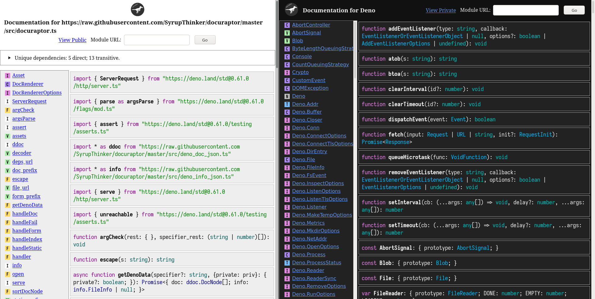

# Docuraptor

Docuraptor is an offline alternative to the [doc.deno.land](https://doc.deno.land) service.

It generates and serves HTML documentation for JS/TS modules with the help of [Deno's](https://deno.land) documentation parser.

## Features

- Offline documentation
- Usable without browser JavaScript, for example in `w3m`
- Dark and Light theme

## Installation

`$ deno install -A https://deno.land/x/docuraptor@20200918.0/docuraptor.ts`

The permissions can be restricted.
Read the `--help` documentation for more details.

## Usage

`$ deno run https://deno.land/x/docuraptor@20200918.0/docuraptor.ts --help`

## Examples

*Docuraptor with `BROWSER=w3m`*

